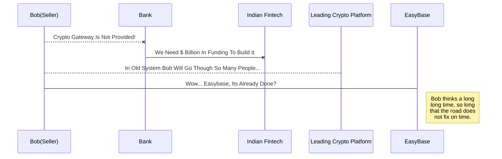
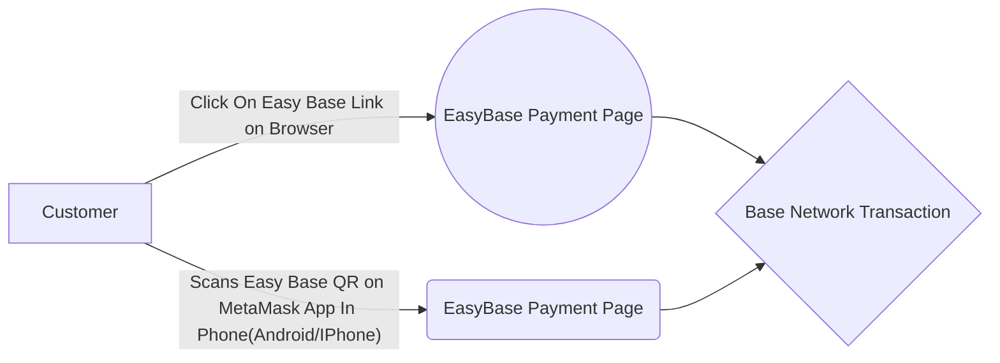

# Welcome to EasyBase - Generates Links/QR/Buttons To Accept Base Network ETH payments On MetaMask on web and social media

Developed By Abhishek Jha  aka **Speedily**. 
If you want to learn about Easybase you can read me. 
If you want to play with Markdown, you can edit me. Once you have finished with me, you can create new files by opening the **file explorer** on the left corner of the navigation bar..

# Files

Files in your **public** folder. **Use Your Own Keys** in Create.js File.

##  Hosting It 

The **Firebase CLI** is freely accessible using terminal in bottom corner of the VSCode Editor. 
You can host a new file by writing the **firebase deploy --only hosting** command in the terminal. 

## Switch to local dev

All your files can be run in local environment using **firebase serve** . You can switch from one to another by clicking a file in the tree.

## Why Easybase?

Easybase converts base wallet address into "payment" collection pages for faster transactions. For example:

|                |Traditional                    |Easy Base                        |
|----------------|-------------------------------|-----------------------------|
|Money Transfer To India| Huge 2% to 4% Fees          | Cheapest Option            |
|QR Code For Base Eth Payments in Shop      |Hard To Find   | Free          |
|Link Payments For Social Media        | Paid Plan + Long Onboarding Time| Free + Instant Links|
|Crypto Payment Gateway For Site        | Paid Billing Software + Long Onboarding Time| Free + Instant Buttons|

## Diagrams

And  a flow chart:

